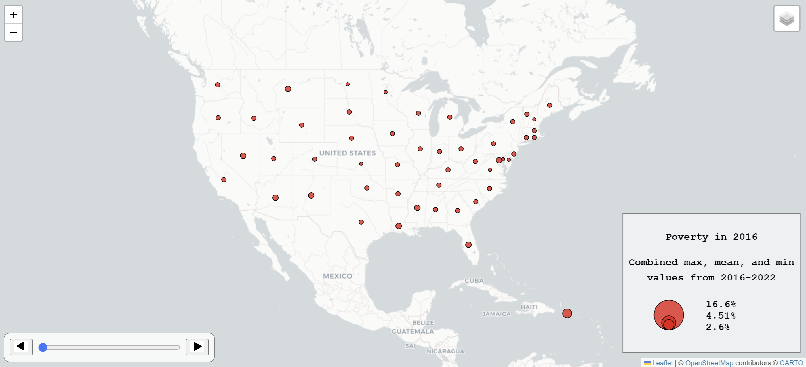

# unit-2 (Activities and Lab 1)
### Lab 1: Poverty in the United States (2016-2022)

This map shows poverty percentages in the United States among individuals that are over the age of 25 and have a bachelors degree.

 